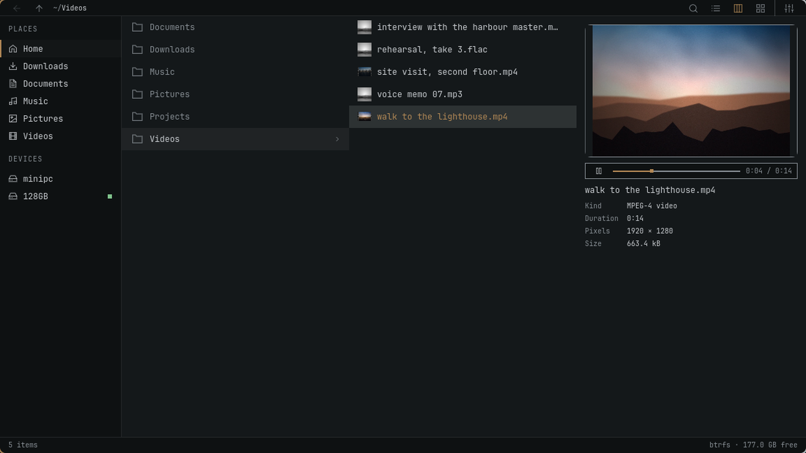

<p align="center">
  
</p>

<h1 align="center">Flea</h1>

<p align="center">
  <strong>The fastest GUI file manager on Linux.</strong><br>
  Keyboard-first. Built for Omarchy.
</p>

<p align="center">
  <a href="#install">Install</a> ·
  <a href="#views">Views</a> ·
  <a href="#performance">Performance</a> ·
  <a href="#keyboard">Keyboard</a> ·
  <a href="https://github.com/thisisgm/flea/releases">Releases</a>
</p>

<p align="center">
  
</p>

Flea combines a Rust backend with a Quickshell interface that follows your Omarchy theme.
Large directories stay responsive: the window loads rows and requests thumbnails as you need them.

- **Three views.** List, columns and grid, with tabs and natural filename sorting.
- **Quick Look.** Press Space for images, PDFs, text, media and archive contents.
- **File operations.** Copy, move, rename, trash, compress and extract, with an undo journal.
- **Network and sharing.** SMB, SFTP, FTPS, WebDAV, NFS, Dropbox and Taildrop.
- **Desktop integration.** Default file manager, “Show in folder” and Open/Save dialogs.
- **Your settings.** Omarchy text sizes, configurable menus and Default, Vim, Mac or Windows keys.

## Install

```bash
omarchy pkg add flea
```

Make Flea your default file manager, file chooser and the app opened by **Super+Shift+F**:

```bash
flea --default
systemctl --user restart xdg-desktop-portal
```

Update through Omarchy:

```bash
omarchy update
```

<details>
<summary>File chooser only, development package and removal</summary>

Use Flea for portal Open/Save dialogs without changing your default file manager:

```bash
flea --picker
systemctl --user restart xdg-desktop-portal
```

For the rolling development build:

```bash
omarchy pkg aur add flea-git
```

Before removing Flea, undo its desktop integration:

```bash
flea --default off
omarchy pkg drop flea
```

If you previously pinned another directory handler, restore that handler explicitly.
[Installation details](docs/install.md) cover dependencies, desktop integration and removal.

</details>

## Views

**List** for file details. **Grid** for photos and clips. **Columns** for browsing folders with a preview beside them.

<p align="center">
  
  
</p>

**Space** opens Quick Look from any view. Page through a PDF, play media or inspect an archive.

<p align="center">
  
</p>

## Performance

Measured on **8 September 2026**, using the source tree released as **0.1.6**.
Cold caches, three runs per app, medians below. Seven GUI apps on the same Omarchy machine.

### 100,000 files

Flea led this run in settled time, window memory and process-tree CPU.
PCManFM mapped its window sooner.

| File manager | First window | Settled | Window PSS | CPU |
|---|---:|---:|---:|---:|
| **Flea** | 749 ms | 1.21 s | 88.0 MiB | 0.89 s |
| Strata | 632 ms | 1.67 s | 93.9 MiB | 1.39 s |
| Dolphin | 699 ms | 5.43 s | 211.2 MiB | 8.97 s |
| Nemo | 780 ms | 22.23 s | 459.6 MiB | 25.34 s |
| Thunar | 534 ms | 22.72 s | 346.0 MiB | 22.33 s |
| PCManFM | 415 ms | 35.76 s | 109.9 MiB | 24.77 s |
| Nautilus | 798 ms | 79.83 s | 335.1 MiB | 18.61 s |

### 2,000 mixed files

The apps produced different amounts of thumbnail work, so settled time and CPU are
**not ranked**. These are observations, not an equal-work speed comparison.

| File manager | First window | Settled | Window PSS | CPU | Thumbnails |
|---|---:|---:|---:|---:|---:|
| **Flea** | 794 ms | 2.49 s | 102.9 MiB | 1.23 s | 36 |
| Dolphin | 682 ms | 14.28 s | 98.8 MiB | 68.18 s | 552 |
| Nautilus | 857 ms | 16.95 s | 172.4 MiB | 12.54 s | 541 |
| Nemo | 788 ms | 3.36 s | 53.7 MiB | 5.25 s | 60 |
| PCManFM | 389 ms | Timed out | 38.9 MiB | 90.19 s | 604 |
| Strata | 610 ms | 7.83 s | 87.2 MiB | 2.31 s | 205 |
| Thunar | 534 ms | 12.88 s | 41.1 MiB | 7.22 s | 221 |

“First window” records compositor registration. “Settled” means 500 ms without process-tree
CPU activity; neither measures input readiness.
PSS covers the window process, excluding helpers and GPU memory. Flea's separate backend used a median **5.3 MiB** on the large
listing and **2.1 MiB** on media. CPU includes the process tree; shared libraries affect PSS.
PCManFM did not settle in any media run. Results describe this machine and workload.

[Method](docs/benchmarks.md) · [Run details and TUI results](docs/bench/results-0.1.6.md) ·
[Scale CSV](docs/bench/f016c-scale.csv) · [Media CSV](docs/bench/f016c-media.csv)

## Keyboard

Press **?** for the full keymap, or **,** to change settings.

| Action | Keys |
|---|---|
| Move / parent / enter | `j` `k` / `h` / `l` |
| Open with the default app | `Enter` |
| Quick Look | `Space` |
| Select / extend selection | `v` / `Shift` + arrows |
| Copy / cut / paste | `y` `x` `p`, or `Ctrl+C` `Ctrl+X` `Ctrl+V` |
| Rename / trash / undo | `r` or `F2` / `dd` or `Delete` / `z` |
| New folder | `Ctrl+Shift+N` |
| Search / filter the list | `f` / `/` |
| Enter a path | `:` or `Ctrl+L` |
| List / columns / grid | `Ctrl+1` / `Ctrl+2` / `Ctrl+3` |
| New tab / close tab / switch tab | `t` / `w` / `1`–`9` |
| Open terminal / context menu | `Ctrl+T` / `m` |
| Show hidden files | `.` |

The Windows preset uses `Ctrl+Shift+1/2/3` for views. Menu visibility does not disable shortcuts.
See [the full key table](keys.toml) for preset bindings and pointer actions.

## Build

Requires Omarchy, Quickshell 0.3.1 or newer, and Rust. See
[installation details](docs/install.md) for runtime and optional dependencies.

```bash
cargo build --release
FLEA_UI="$PWD/ui" ./target/release/flea --gui
```

Pass a directory to open it, or `--select <path>` to reveal a file. The terminal interface
is not implemented yet.

```bash
./tests/run-all.sh
```

The headless runner builds both profiles and reports suites that need a display, credentials
or a package. [The test suites](tests/) cover file operations, previews, persistence and input;
[the protocol guide](docs/protocol.md) documents the backend.

## Support

If this saved you an afternoon, you can
[buy me a coffee](https://buymeacoffee.com/thisisgm).

## Licence

[MIT](LICENSE).
