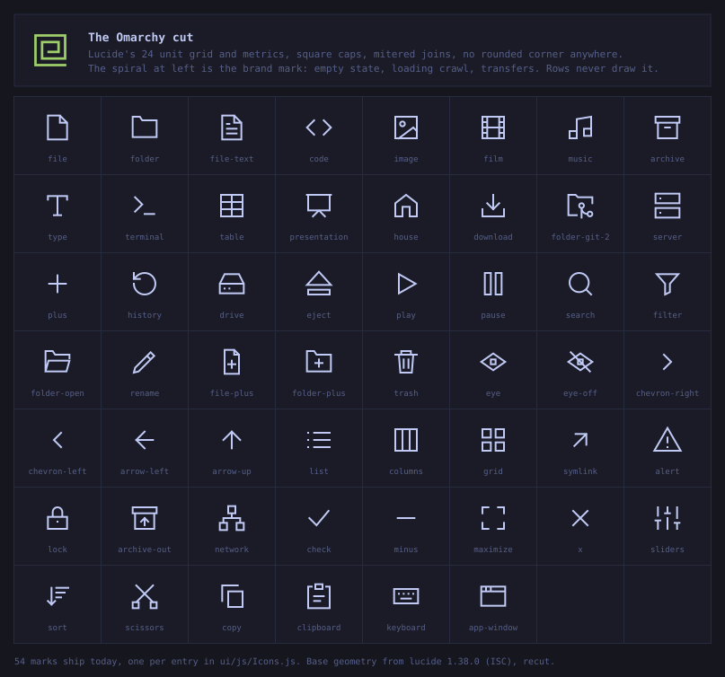

<p align="center">
  
</p>

<h1 align="center">Flea</h1>

<p align="center">
  <strong>The fastest GUI file manager on Linux.</strong><br>
  Keyboard first, native to Omarchy, and it holds only the rows you can see.
</p>

<p align="center">
  
</p>

Nautilus gets four things wrong on Hyprland: the keyboard is an afterthought, remote and
cloud handling is painful, it is slow and heavy, and it does not look like the rest of the
desktop. Flea is a standalone application built for Omarchy from the ground up, not a
Nautilus extension. A Quickshell front end over a Rust backend that keeps the whole
directory and hands the window only what fits on screen.

## Install

Flea is for Omarchy. `omarchy` and `quickshell` are hard dependencies, so it will not install on a
plain Arch box.

```bash
omarchy pkg aur add flea && flea --default
```

That is the whole install, and the last command is the only one you might leave out. Flea is on the
AUR, so `omarchy pkg aur add` builds and installs it the way it installs anything else, and
`omarchy update` keeps it current from then on. `flea --default` makes Flea the default file
manager, the way `omarchy default browser` makes a browser the default: it becomes the handler for
`inode/directory`, and Omarchy's two file-manager keys, `SUPER + SHIFT + F` and
`SUPER + ALT + SHIFT + F`, open it instead of Nautilus. It prints what it replaced, and
`flea --default off` puts both back.

`sudo pacman -Rns flea` takes the package off again, and pacman's own file list is what makes that
removal provable. `flea --default` is the one thing pacman does not own, because it is your
preference and not a file of the package's: run `flea --default off` first, or see
[`docs/install.md`](docs/install.md) for the two lines it would otherwise leave behind.

`flea-git` is the same package built from `main` rather than from the last release, if you would
rather track it. Building from a clone still works too, and is what the repository's own `PKGBUILD`
is for: `git clone https://github.com/thisisgm/flea.git && cd flea && makepkg -si`.

Four optional packages each unlock one feature and nothing else: `libarchive` for archive listing
and extraction, `7zip` for `.7z` archives, `imagemagick` for image conversion, and `tailscale` for
Taildrop sharing.

[`docs/install.md`](docs/install.md) has the rest: what lands on disk, what `flea --default` writes
and how to undo it by hand, and how the package proves itself.

## Update

```bash
omarchy update
```

Nothing Flea-specific to remember. `omarchy update` upgrades AUR packages on every run, so Flea
comes up with the rest of the system, and your `flea --default` choice survives because that is a
preference and not a file of the package's.

The AUR packages are maintained by [@taxin-404](https://aur.archlinux.org/account/taxin-404), not by
this repository.

## Measured against the field

Two fixtures on one box, caches dropped before every launch, three runs per entrant, medians of the
three. Every entrant is started by its own launcher, the way you would start it, on an idle box:
the harness waits rather than start a run above a one-minute load average of 0.50.

Every table and every place below is printed by
[`tools/flea-bench-report`](tools/flea-bench-report) from two runs kept on disk and read by column
name: `scale-rc-2026.csv` for the 100,000 file fixture and `media-rc-2044.csv` for the media
fixture, each beside the manifest that records the box, the fixture and the versions. The
method, the fixtures and what each column actually measures are in
[`docs/benchmarks.md`](docs/benchmarks.md).

Entrant versions, read off the installed artefact by the harness rather than typed in. GUI: `flea`
at `target/release/flea` as built 2026-09-02 20:13:50, 972,008 bytes; `nautilus` 50.2.2-1, `thunar`
4.20.9-1, `pcmanfm` 1.4.0-2, `nemo` 6.6.4-1, `dolphin` 26.08.0-4, and `strata` v0.6.1 built from
source. TUI, every one of them under kitty 0.48.2-1: `yazi` 26.8.15-1, `mc` 4.8.33-1, `broot`
1.59.0-1, `nnn` 5.3-1, `lf` 42-1, `ranger` 1.9.4-5, `xplr` 1.0.1-1, `superfile` 1.6.0-1.

Both runs measured that binary as they found it. The harness never rebuilds, and it refuses to
start when `src`, `Cargo.toml` or `Cargo.lock` is newer than the binary, which none of them was;
it deliberately does not check `ui/`, because QML is read at run time and never compiled in. The
tree both runs measured is `b857757`, clean, and the last `ui/` change in it is `b5d9735`.
Anything committed after that is not in the tables below.

**Every timing below is a magnitude from one machine and not a citable constant.** What survives a
re-run is the ordering and the size of the gaps, not the digits. Two batches of this harness on
this box, hours apart on the same day and with nothing aimed at either, put Flea's settle lead over
`dolphin` on the scale fixture at 4.27x and then at 4.57x, and moved `lf`'s settle time on the
media fixture from 631 ms to 1,744 ms, which is 2.8x.

**Every timing carries the work beside it.** 2,612 ms against 14,514 ms is 36 thumbnails against
552, one screenful against fifteen, and the time column on its own would say the opposite of what
happened. The GUI and TUI brackets are judged apart and never share a table, because a TUI previews
the one file under the cursor where a GUI renders a grid of them.

### 100,000 files, none of them thumbnailable

Work is equal by construction. The thumbnailable denominator is 0: every entrant lists the same
100,000 entries and the fixture holds nothing any of them could thumbnail, so this run took no
thumbnail count at all and the work column says so rather than printing a zero nobody measured.
The times compare straight across.

<div align="center">
  
</div>

| entrant | first window | settled listing | work done | memory, PSS | CPU, process tree | runs |
|---|---|---|---|---|---|---|
| `flea` | 752 ms | 1,166 ms | not measured | 106.7 MiB | 0.96 s | 3 |
| `dolphin` | 681 ms | 5,339 ms | not measured | 221.3 MiB | 9.02 s | 3 |
| `strata` | 790 ms | 7,856 ms | not measured | 113.0 MiB | 7.62 s | 3 |
| `nemo` | 737 ms | 22,315 ms | not measured | 460.9 MiB | 25.53 s | 3 |
| `thunar` | 511 ms | 23,084 ms | not measured | 348.0 MiB | 22.70 s | 3 |
| `pcmanfm` | 410 ms | 35,785 ms | not measured | 111.3 MiB | 24.80 s | 3 |
| `nautilus` | 793 ms | 79,025 ms | not measured | 334.3 MiB | 18.80 s | 3 |

Column by column, and the one column Flea does not win is in the same list as the three it does:

- **Time to a settled listing:** 1,166 ms, **first of seven**, ahead of `dolphin` at 5,339 ms,
  4.57x. Flea's three runs settled at 1,398, 1,152 and 1,166 ms, and the earlier batch of the same
  day read 4.27x on this comparison, so take the lead as about 4.5x rather than as a digit.
- **Memory, PSS:** 106.7 MiB, **first of seven**, ahead of `pcmanfm` at 111.3 MiB, 1.04x. Flea runs
  a second process, its backend, sampled separately at 5.3 MiB; the pair reads 112.0 MiB, which is
  past `pcmanfm`. That rise is Flea's own and not measurement noise, and it is not yet attributed
  to a commit. The column above samples Flea the way it samples every other entrant.
- **CPU, process tree:** 0.96 s, **first of seven**, ahead of `strata` at 7.62 s, 7.93x.
- **Time to first window:** 752 ms, fifth of seven, behind `pcmanfm` at 410 ms, 1.83x.

Fifth to paint a window and first to be usable, and those are not the same column. `pcmanfm` puts a
frame on screen in 410 ms and then takes about 35.8 seconds to finish the listing Flea finishes in
about 1.2 seconds. A window that is drawn but still filling is not a file manager you can use yet,
which is why the settle column is the one this project optimises and the first-window column is
reported rather than chased.

The CPU column charges every entrant its whole process tree, so an out-of-process thumbnailer is
counted against it. The memory column does not: it sampled the window process, plus Flea's backend
because Flea is the entrant that has one, which understates any rival whose work happens elsewhere.

### 2,000 files, 1,800 of them thumbnailable, cold cache

<div align="center">
  
</div>

| entrant | first window | settled listing | work done | memory, PSS | CPU, process tree | runs |
|---|---|---|---|---|---|---|
| `flea` | 833 ms | 2,612 ms | 36 thumbnails | 112.6 MiB | 1.42 s | 3 |
| `nemo` | 765 ms | 3,372 ms | 60 thumbnails | 55.3 MiB | 5.13 s | 3 |
| `thunar` | 511 ms | 12,785 ms | 221 thumbnails | 40.7 MiB | 7.27 s | 3 |
| `dolphin` | 672 ms | 14,514 ms | 552 thumbnails | 101.5 MiB | 68.11 s | 3 |
| `nautilus` | 819 ms | 17,006 ms | 541 thumbnails | 172.6 MiB | 12.81 s | 3 |
| `strata` | 798 ms | 30,792 ms | 205 thumbnails | 70.3 MiB | 1.82 s | 3 |

**Not ranked.** An entrant whose work was not measured cannot be compared on time, and one that
never settled has no time.

| entrant | settled listing | work done | why it is not ranked |
|---|---|---|---|
| `pcmanfm` | never settled | 605 thumbnails | never settled in any of the 3 runs |

`strata`'s three rows were taken a day after the rest of the field. It persists no thumbnail, so the
cache count every other row uses saw nothing and it sat unranked while it was in fact drawing 205 of
them; the re-run counts that work by a live watch across the same three runs that take the timing.
The method, the run conditions and the two differences from the batch are in
[`docs/bench/media-rc-2044.manifest.md`](docs/bench/media-rc-2044.manifest.md).

**Flea settles first here while drawing the fewest thumbnails of any ranked entrant: 36 against
`dolphin`'s 552.** That first place means nothing read apart from the work column beside it, because
the two were not asked the same question. Flea's 36 is the viewport and nothing else, by design:
thumbnails are asked for only when the list stops moving and only for the rows on screen, which is
the same design that takes the settle column on the 100,000 file fixture.

Column by column. The denominator moves because an entrant that never settled still has a window, a
memory and a CPU number, so `pcmanfm` is counted on three of these four:

- **Time to a settled listing:** 2,612 ms, **first of six**, ahead of `nemo` at 3,372 ms, 1.29x,
  and at a fifteenth of `dolphin`'s work, as above.
- **CPU, process tree:** 1.42 s, **first of seven**, ahead of `strata` at 1.82 s, 1.28x.
- **Memory, PSS:** 112.6 MiB, sixth of seven, behind `pcmanfm` at 40.5 MiB, 2.78x; fifth of the six
  ranked entrants, behind `thunar` at 40.7 MiB. With Flea's backend, 114.6 MiB, and still sixth.
- **Time to first window:** 833 ms, seventh of seven, behind `pcmanfm` at 390 ms, 2.13x; sixth of
  the six ranked entrants, behind `thunar` at 511 ms.

Ranking `strata` cost Flea a place on memory and cut the CPU lead from 3.61x over `nemo` to 1.28x
over `strata`, now the nearest rival on that column: 1.82 s against Flea's 1.42 s, where the next
entrant is `nemo` at 5.13 s. It is lighter than Flea too, 70.3 MiB against 112.6, while drawing 205
thumbnails to Flea's 36. What it does not take is the settle column, where it is the slowest ranked
entrant here at 11.8x Flea's time.

First window moved the wrong way between the earlier batch of the same day and this one: 689 ms to
752 ms on the scale fixture, and 774 ms to 833 ms here, where Flea is seventh of seven. It has never
been a column Flea won and it blocks nothing. The scale move is smaller than the range across Flea's
own three runs in that batch, 732 to 913 ms; the media move is larger than its own range of 795 to
835 ms, so read the media one as a move and the scale one as noise.

### What each entrant can actually thumbnail

Speed is not the only column. The field run above cannot answer this one: the fixture's names sort
by format, so an entrant that settles early never reaches the photos and its per-format counts say
where it stopped rather than what it can do. A separate probe,
[`tools/flea-bench-capability`](tools/flea-bench-capability), gives every entrant one file per
format, a private cache and forty-five seconds, ranks nothing and times nothing, and counts what
landed by md5 key against the fixture's own map.

| entrant | jpg | png | webp | heic | mp4 | webm | mkv | txt |
|---|---|---|---|---|---|---|---|---|
| `flea` | yes | yes | yes | yes | yes | yes | yes | - |
| `nautilus` | yes | yes | yes | yes | yes | yes | - | - |
| `thunar` | yes | yes | yes | yes | yes | yes | yes | - |
| `pcmanfm` | - | yes | - | - | yes | yes | - | - |
| `nemo` | yes | - | yes | - | - | - | - | - |
| `dolphin` | yes | yes | yes | - | yes | yes | yes | - |
| `strata` | yes | yes | yes | - | yes | yes | yes | - |

txt is the control: no thumbnailer draws a text file, so an entrant claiming one there would be a
broken measurement rather than a capable entrant.

`strata`'s row is the one measured by a live watch rather than by a thumbnail-cache count, because
it is the one entrant that persists no thumbnail: it renders each one into a scratch directory it
deletes immediately and keeps the image in memory. A cache count sees none of that, which is why
this table read "thumbnails nothing" for a whole release. The field run above now counts its work
the same way, in its own runs.

The field run's own per-format counts answer the other question, how far each entrant got before it
stopped, and they must not be read as the table above. Flea's zero in `jpg` here is the viewport it
drew, not a format it cannot produce.

| entrant | thumbnails | by format, run 1 |
|---|---|---|
| `flea` | 36 | `heic=0;jpg=0;mkv=6;mp4=24;png=0;txt=0;webm=6;webp=0;unknown=0` |
| `nautilus` | 541 | `heic=13;jpg=0;mkv=0;mp4=400;png=14;txt=0;webm=100;webp=14;unknown=0` |
| `thunar` | 221 | `heic=0;jpg=0;mkv=37;mp4=148;png=0;txt=0;webm=36;webp=0;unknown=0` |
| `pcmanfm` | 605 | `heic=0;jpg=0;mkv=0;mp4=400;png=105;txt=0;webm=100;webp=0;unknown=0` |
| `nemo` | 60 | `heic=0;jpg=45;mkv=0;mp4=0;png=0;txt=0;webm=0;webp=15;unknown=0` |
| `dolphin` | 552 | `heic=0;jpg=50;mkv=84;mp4=335;png=0;txt=0;webm=83;webp=0;unknown=0` |
| `strata` | 205 | `heic=0;jpg=0;mkv=34;mp4=137;png=0;txt=0;webm=34;webp=0;unknown=0` |

### The TUI bracket

Judged apart and on a different measure. Every entrant runs under kitty in the configuration its own
project documents, recorded verbatim in the manifest. These are the media fixture's rows, the run
with a file worth previewing in it. The first-window column here is the terminal's own startup cost
and is not comparable to a GUI row. An entrant with no image preview reads N/A, never 0. Flea's own
terminal interface is not built yet, so it does not appear.

| entrant | first window | settled listing | time to first preview | preview runs |
|---|---|---|---|---|
| `yazi` | 274 ms | 2,033 ms | 753 ms | 3 of 3 |
| `mc` | 275 ms | 860 ms | N/A | 0 of 3 |
| `broot` | 275 ms | 460 ms | 676 ms | 1 of 3 |
| `nnn` | 275 ms | 501 ms | 737 ms | 3 of 3 |
| `lf` | 257 ms | 1,744 ms | 735 ms | 3 of 3 |
| `ranger` | 274 ms | 1,006 ms | 1,123 ms | 3 of 3 |
| `xplr` | 293 ms | 605 ms | N/A | 0 of 3 |
| `superfile` | 293 ms | 1,162 ms | N/A | 0 of 3 |

A preview cell of N/A means no run recorded one: `mc`, `xplr` and `superfile` recorded -1 in all
three runs, which is the harness saying it never saw a preview rather than that it saw a fast one,
and `broot`'s 676 ms is one run of three. That sentinel is dropped and never averaged in, and it is
the same rule that keeps `pcmanfm`'s never-settled media row below the rule above instead of
sorting it to first place. This is the least stable column in either bracket: between the two
batches of the same day `superfile` went from a preview in all three runs to none, and `broot` went
from none to one of three.

## Three views of the same directory

A grid of thumbnails, for when the names are not the point.

<p align="center">
  
</p>

A Miller columns board, with the preview and the file's facts in the last column.

<p align="center">
  
</p>

And Space opens a Quick Look over any of them. PDFs page, media plays, archives list.

<p align="center">
  
</p>

## Every operation says so, and `z` takes it back

The status bar is the running commentary. It carries the item count and the filesystem's free
space at its ends, and the last operation and its undo in between.

<p align="center">
  
</p>

Ctrl-Shift-n makes a folder and opens the rename field on it with the stem already selected, so
the name is one typed word away.

<p align="center">
  
</p>

## What it does

- **Finder's natural name ordering, directories first.** `file_2` comes before `file_10`,
  case is ignored, and leading zeros are worth nothing. Directories group ahead of files, in
  both front ends, and the backend's `list` sorts them that way so no view can disagree.
- **A preview column** for text, images, video and audio, PDF with page navigation, and an
  archive's contents. Video and audio play in place.
- **Thumbnails from the shared freedesktop cache** the whole desktop reads and writes, for
  jpg, png, webp, heic, mp4, webm and mkv. Measured against the field, only thunar matches
  that set; dolphin has no heic and nautilus no mkv. They are asked for only when the list
  stops moving and only for the rows on screen, so a fling through a directory asks for
  nothing and nothing is generated for a row you did not look at.
- **Thumbnailing is mandatory-sandboxed.** Without `bwrap` and `prlimit` on `PATH` the job
  is refused rather than run unconfined.
- **File operations with an undo journal.** Copy, cut, paste, trash, rename, duplicate,
  compress, extract and convert, each reversible with `z`.
- **Network and cloud in the rail.** SMB and NFS mounts through `gio`, Taildrop to a peer,
  and Dropbox as a first-class destination. Local disks and removable volumes group below them
  under DEVICES, which the screenshots here crop away rather than retouch: that row is labelled
  with the machine's own hostname.
- **A path bar and directory tabs.** `:` or `Ctrl+L` types a path, with Tab completion over the
  directories one level down; `t`, `w` and `1` to `9` open, close and switch up to nine tabs in
  one window, and only one listing is ever live.
- **Columns you choose.** Right click the column titles to hide Mode, Size, Date Modified or
  Kind; the choice outlives the window, and the pane's width still wins over a column it cannot
  carry. `Ctrl+Shift+Plus` and `Minus` scale the whole interface, `Ctrl+Shift+0` puts it back.
- **It looks like Omarchy** because it reads the live palette, the same tokens the shell
  bar uses, and every mark is drawn in the Omarchy cut, which is its own section below.

## The Omarchy cut

Every mark Flea draws shares one edge, taken from the Omarchy brand spiral: lucide's 24 unit grid
and stroke conventions, but square caps, mitered joins, and every rounded corner baked into a path
replaced with a hard one. Genuine curves stay, because a circle is not a softened corner. Music note
heads are squares rather than circles, which is the set's tell at 16 px.

<p align="center">
  
</p>

That specimen is generated by [`tools/flea-glyph-sheet`](tools/flea-glyph-sheet) from
[`ui/js/Icons.js`](ui/js/Icons.js), the one path table in the tree: 47 marks, one `d` string each,
drawn here at the app's own stroke of 1.5. Re-run the tool rather than editing the sheet. Nothing is added to it
until a surface actually draws it. Colour never comes from this language either. Every mark takes a
palette role from the live Omarchy theme rather than a brand hex, so the whole set recolours when
the desktop does. The only literal colours anywhere in the UI are the five fallbacks in
`Theme.qml`'s `fallbackColor`: three for roles the shell's own palette does not model, and two more
read before the palette has loaded. Omarchy themes are not authored to WCAG AA, so Flea keeps each
role's hue and walks its lightness until muted, symlink and executable clear 4.5:1 against the
ground they are drawn on. On a theme that already clears it nothing moves.

The spiral itself is reserved. It is the brand, not a row mark, and rows and menus never draw it. It
appears in the empty state as a stroke on that same 24 unit grid, painting itself in from blank over
1.8 s above a caption that rotates through eight of them, and as a stroke crawl while a listing
loads or a media preview buffers: the same path with a dash offset running around it, 1.6 s a
cycle, never a rotation. A 150 ms hold-off sits in front of the crawl
and a local directory settles inside it, so the crawl belongs to the slow sources: a network
mount, a cold disk, or a search still walking a subtree, which is the shot below.

<p align="center">
  
</p>

<p align="center">
  
</p>

Tailscale and Dropbox are the one exception. Both are reproduced from their own artwork rather than
recut, because the cut governs Flea's own glyphs and stops at somebody else's identity.

The terminal interface draws characters, not paths, so it does not inherit this set. Its mark column
is one character per kind, upgrading to Nerd Font glyphs where the terminal has them.

## Requirements

- Omarchy, with Quickshell 0.3.1 or newer, for the UI.
- Rust to build the backend. This tree is built and tested against rustc/cargo 1.98.
- `bubblewrap` for `bwrap` and `util-linux` for `prlimit`, both required for thumbnailing
  as described above. Everything else works without them.
- `bsdtar` and optionally `7z` for archives, `gio` for network mounts. Each is probed at
  startup and its absence removes only its own feature.
- Qt's PDF and Multimedia modules for the preview column, which ship with Qt 6 on this
  platform.

## Building and running

```bash
cargo build --release
```

The binary lands at `target/release/flea`. Running it dispatches by mode:

```bash
flea [path]                # terminal in a real terminal, a window everywhere else
flea --gui [path]          # force the window
flea --tui [path]          # force the terminal interface (not built yet)
flea --select <uri|path>   # open the containing directory with that entry selected
flea --default [off]       # become the desktop's default file manager, or stop being it
```

`--tui` and `--gui` are mutually exclusive. With neither given, `flea` opens the terminal
interface only when both stdin and stdout are a real terminal, and opens the window
otherwise, which is the branch a `.desktop` launcher takes since it has no controlling
terminal. `--default` opens no window: it sets the `inode/directory` handler and Omarchy's
two file-manager keys, and `off` undoes both, see
[`docs/install.md`](docs/install.md). `--backend`, `--prewarm` and `--open` are the
internal modes the UI and the benchmarks drive directly; `flea --open <path>` is what Enter
on a file runs, and it hands the file to `xdg-open` and exits. See `AGENTS.md` for their
contract.

`--select` accepts either a `file://` URI (percent-decoded) or a bare path, opens its
parent directory, and puts the cursor and the selection on that one entry once the
directory's first page of rows arrives. A target that does not exist still opens its
parent, with nothing selected: this is the one nautilus call site the Dropbox panel needs
(`Service.qml` reveals a synced file with `nautilus --select`). `--print-target` is a
test-only flag that resolves `--select`'s pair and prints `<parent> <target>` instead of
opening a window; it exists so the resolution is testable without a display.

Run the development UI directly, bypassing the launcher, from the repository root:

```bash
FLEA_PATH="$HOME" FLEA_BIN="$PWD/target/release/flea" qs -p "$PWD/ui"
```

The backend protocol is newline-delimited JSON over the child process's stdin and stdout;
its exact wire shape is documented in [`docs/protocol.md`](docs/protocol.md).

## Keyboard

`keys.toml` is the one key table and `ui/js/Keymap.js` is generated from it, so this list
and the application cannot disagree.

| Binding | Action |
|---|---|
| `j`, `k`, Down, Up | Move the cursor one row |
| `g`, `G` | First or last row |
| Ctrl-d, Ctrl-u | Half a viewport |
| `h`, Backspace, Ctrl-Up | Parent directory |
| `l` | Browse forward: enter a directory, preview a file, page a PDF, or activate a rail/share row; unused in media |
| Return, Enter, Ctrl-Down | Open a directory, or open a file with the desktop's handler |
| Space | Quick Look, and close it |
| Left, Right | Page a PDF, or seek in media |
| `v` | Toggle selection on the row |
| `J`, `K`, Shift-Down, Shift-Up | Extend the selection |
| Ctrl-a | Select all |
| `/` | Filter the listing in place, in the list view |
| `f`, Ctrl-f | Search |
| `o` | Reveal the result in its own directory |
| `y`, `x`, `p`, Ctrl-c, Ctrl-x, Ctrl-v | Copy, cut, paste; the chords are what Omarchy's Super-c, Super-x and Super-v deliver |
| `dd`, Delete, Ctrl-Delete | Trash. Two presses on the letter, one on the key |
| `r`, F2 | Rename |
| `z`, Ctrl-z | Undo the last operation |
| Ctrl-Shift-n | New folder |
| `a`, Ctrl-k | Add a network mount; `a` from the rail, Ctrl-k from either view |
| Ctrl-e | Eject the rail's device, or the removable volume the listing is inside |
| Ctrl-1, Ctrl-2, Ctrl-3 | List, columns, grid |
| Ctrl-Shift-+, Ctrl-Shift-- , Ctrl-Shift-0 | Interface scale up, down, back to the desktop's own |
| `m` | Open the context menu on the cursor row; in the rail, eject or unmount |
| `s`, `S` | Step the sort column, reverse the sort |
| `.`, Ctrl-Shift-. | Show hidden files |
| Tab | Move focus between the rail and the view |
| `t` | Open a new tab at the current folder |
| `w` | Close the current tab |
| `1` to `9` | Switch to that tab |
| Escape | Cancel a search, clear the filter, drop the selection, clear the status line |

Finder hands land: every Cmd chord above is its Ctrl twin, added beside the vim key rather
than in its place, because Hyprland keeps Super for itself and Omarchy's own universal
clipboard delivers Super-c, Super-x and Super-v as the Ctrl chords. Two Finder conventions are
deliberately not matched: Enter opens rather than renames, because every Linux file manager
and the vim table open on Enter and the TUI shares this table (rename is `r` or F2), and Cmd-d
is not duplicate, because Ctrl-d already pages with Ctrl-u as its pair (duplicate is a menu
row). The keymap sheet writes a chord as `^c`, and `^N` with a capital means Ctrl-Shift.

Clicking a column header sorts by it, and clicking the sorted column reverses it. Name,
Size and Date Modified are real orders and `s` steps through the three; the two metadata
orders stat every row of the directory first, across the cores, and keep nothing
afterwards, so a listing in name order pays none of it and
[`docs/protocol.md`](docs/protocol.md) records what that pass measured and when. Mode and
Kind are not sort orders at all, so each of the two says so and the mark stays where it
was. Directories group ahead of files in every order, and in a filtered view as well.

A left click puts the cursor on a row and drops any other selection, and the second one opens
it, which is macOS's rule rather than single-click-to-open; on a search result the second click
takes you to the file instead, in its own directory with the row selected, which is what `o`
does from the keyboard. Ctrl-click adds a row to the selection and Shift-click
extends the selection to it, and neither ever opens anything whatever the tap count. Right
click moves the cursor to a row and opens the context menu there: raised inside a multi-row
selection it acts on all of it, and raised outside one the selection collapses to that row,
because every entry the menu draws describes the row under the pointer. `m` opens the same menu
under the cursor row; `j` and `k` step it, and it closes on Escape, on a click outside, on
scrolling, and when its action runs. The columns view's two neighbour columns are peeks with no cursor of
their own, so one click there shows a directory in the middle column, the way a column view
reveals rather than opens, and a file still waits for the second click. The rail is the one
place a single click opens, as Finder's own sidebar does. `keys.toml` carries the whole table,
its `[[pointer]]` half included.

`/` opens a filter strip under the column header and narrows the rows already listed as
you type: no walk, no round trip, and the sort order and the directories-first grouping
both survive it. Enter hands the keyboard back to the list with the filter standing, so
every action key works over the narrowed rows, and Escape clears it. A row the filter
hides leaves the selection with it, because a selection you cannot see is one you can act
on by accident. It filters the rows the pane holds, and says so in the strip when that is
less than the whole directory.

`:` and `Ctrl+L` open the path bar, and so does a double click on the path itself: the strip
above the listing becomes the line you type into, opening on the current directory with the
whole line selected, so a name typed straight away replaces it. A leading `/` is absolute, a
leading `~` is home, anything else is relative to the directory you are already in, and a
`file://` URI pasted from another application is read as the path it names. Tab completes
against the directories one level down, growing the line as far as the names agree and adding
the separator when only one is left, so Tab, Tab, Tab walks a tree. Enter goes, Escape leaves
the pane where it was, and `.` typed as the first character of a name completes hidden
directories whether or not the listing is showing them.

`t` opens a new tab at the current folder, `w` closes the current one, and `1` through `9` switch.
The tab strip shows only when there are two or more, so a single listing keeps the chrome the
first paint uses. The last tab cannot close; the window still closes with the compositor's close
chord.

## Testing

```bash
./tests/run-all.sh            # every suite that needs only a shell, and both cargo profiles
cargo test                    # unit tests
./tests/js.sh                 # pure QML JavaScript helpers
./tests/protocol.sh           # drives the built binary over real stdin
./tests/modes.sh              # asserts the mode contract
./tests/ops.sh                # file operations and the undo journal
./tests/archive.sh            # archive listing, extract and compress
./tests/thumbs.sh             # the release binary against the media fixture
./tests/sandbox.sh            # the thumbnail jail and its refusals
./tests/ui.sh                 # drives the real window
./tests/drag.sh               # the internal drag, through a real pointer on uinput
./tests/bench.sh              # the field bench harness itself
./tests/budget.sh             # the file-budget tool
./tests/keymap-gen.sh         # ui/js/Keymap.js still matches keys.toml
./tools/flea-acceptance       # the everything-works battery
./tools/flea-file-budget      # the file budget, against this tree
./tools/flea-field-bench      # the cold field run against the other file managers
./tools/flea-media-fixture    # builds the 2,000 file media fixture
./tools/flea-bench-report     # a field run's CSV as the tables in this README
```

`./tests/run-all.sh` is the one command. It builds both cargo profiles, because `protocol.sh`
drives the debug binary and `thumbs.sh` the release one, runs the nine suites above that need
nothing but a shell, and reads each suite's own exit code rather than a pipeline's. It then
names `ui.sh`, `drag.sh` and `bench.sh` and says what each of the three wants: a display, a
real pointer, an idle box. There is no CI, and `PKGBUILD`'s `check()` runs `cargo test` alone.

`tools/flea-acceptance` derives its checklist at run time from the protocol document, the
key table, the context menu, the design canvas and the sidebar, so it cannot be smaller
than the product. `tools/flea-sandbox-guard` owns every destructive path in the tools
above: nothing writes or deletes outside a fixture root that carries its own marker file.

## Support

If this saved you an afternoon, you can
[buy me a coffee](https://buymeacoffee.com/thisisgm).

## Licence

MIT, and the full text is in [`LICENSE`](LICENSE).
